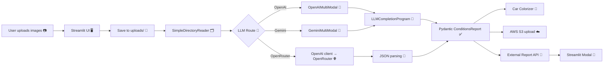
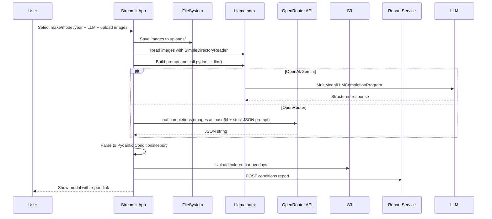

# AutoTraceAi System Architecture

🚗 Overview

- Streamlit UI handles image upload, selections, and result display.
- Images are saved to `uploads/`, read as documents, and passed to an LLM.
- The LLM returns a structured JSON that is validated against a Pydantic model.
- A car colorizer generates visual overlays; results are uploaded to S3 and a report is created via an external API.

## Components

- 🖥️ `Streamlit` UI (`Home.py`, `pages/Example.py`)
- 🗂️ `SimpleDirectoryReader` from LlamaIndex (image ingestion)
- 🔀 LLM routing:
  - OpenAI via LlamaIndex (`OpenAIMultiModal`)
  - Gemini via LlamaIndex (`GeminiMultiModal`)
  - OpenRouter via OpenAI-compatible client (direct API calls)
- ✅ Pydantic models for structured outputs (`ConditionsReport`, `DamagedPart`, `DamagedParts`)
- 🎨 `car_colorizer.py` generates annotated side overlays
- ☁️ AWS S3 (`boto3`) for storing colorized images
- 📄 External Report Service (`https://dmg-decoder.up.railway.app`)

## Data Flow



## Sequence



## System Prompts

Prompts are constructed and provided in `pydantic_llm.py`.

- Initial prompt for the damage/conditions workflow (parameterized by make/model/year):

```text
The images are of a damaged {make_name} {model_name} {year} car.
The images are taken from different angles.
Please analyze them and tell me what parts are damaged and what is the estimated cost of repair.
```

- Conditions report prompt (scoring instructions):

```text
The images are of a damaged vehicle.
I need to fill a vehicle condition report based on the picture(s).
Please fill the following details based on the image(s):
FRONT
1. Roof
2. Windshield
3. Hood
4. Grill
5. Front bumper
6. Right mirror
7. Left mirror
8. Front right light
9. Front left light
BACK
10. Rear Window
11. Trunk/TGate
12. Trunk/Cargo area
13. Rear bumper
14. Tail lights
DRIVERS SIDE
15. Left fender
16. Left front door
17. Left rear door
18. Left rear quarter panel
PASSENGER SIDE
19. Right rear quarter
20. Right rear door
21. Right front door
22. Right fender
TIRES
T1. Front left tire
T2. Front right tire
T3. Rear left tire
T4. Rear right tire

For each of the details you must answer with a score based on this descriptions to reflect the condition:
- 0: Not visible
- 1: Seems OK (no damage)
- 2: Minor damage (scratches, dents)
- 3: Major damage (bent, broken, missing)
```

- OpenRouter system prompt (enforced for strict JSON):

```text
You are an expert auto damage estimator. Analyze provided vehicle images and respond ONLY with JSON.
Each condition field must be an integer: 0 (not visible), 1 (OK), 2 (minor), 3 (major).
```

- Schema hint (subset shown) to ensure strict JSON structure:

```text
Return a strictly valid JSON object with these required fields:
roof, windshield, hood, grill, front_bumper, right_mirror, left_mirror,
front_right_light, front_left_light, rear_window, trunk_tgate, trunk_cargo_area,
rear_bumper, right_tail_light, left_tail_light, left_rear_quarter, left_rear_door,
left_front_door, left_fender, left_front_tire, left_rear_tire, right_rear_quarter,
right_rear_door, right_front_door, right_fender, right_front_tire, right_rear_tire.
```

## Structured Output

- The LLM response is parsed into the `ConditionsReport` Pydantic model, which contains integer fields for each part (0–3).
- This structured result drives:
  - 🎨 `car_colorizer.py` for overlays per side (`front`, `back`, `left`, `right`).
  - ☁️ S3 uploads of the overlays.
  - 📄 A POST to the external report API, shown in a Streamlit modal.

## Project Structure (key paths)

```
AutoTraceAi/
├── Home.py                 # Main Streamlit app
├── pages/Example.py        # Example page
├── pydantic_llm.py         # Prompts, models, routing to LLMs
├── car_colorizer.py        # Overlay generation from conditions
├── uploads/                # Saved user images
├── images/car_parts/       # Part icons used for overlays
├── .env.example            # Environment variable examples
└── README.md
```

## Runbook (Windows)

Prerequisites

- Python `3.11`
- Poetry (`pipx install poetry` or `pip install poetry`)
- OpenRouter account and API key (if using OpenRouter)
- AWS credentials (if you want S3 uploads to succeed)

Environment variables

- Create a `.env` file in the project root with at least:

```bash
OPENAI_BASE_URL=https://openrouter.ai/api/v1
OPENAI_API_KEY=sk-or-...your-key...

# Optional: if you want to use Gemini directly via Google
# GOOGLE_API_KEY=your-google-api-key

# Optional: for S3 uploads
# AWS_ACCESS_KEY_ID=...
# AWS_SECRET_ACCESS_KEY=...
# AWS_DEFAULT_REGION=us-east-1
```

Install and run

- Install dependencies: `poetry install`
- Start the app: `poetry run streamlit run Home.py`
- Open the app at `http://localhost:8501`

In-app steps

- Select car make/model/year.
- Pick LLM route:
  - `OpenAI` for OpenAI multimodal via LlamaIndex.
  - `Gemini` for Gemini multimodal via LlamaIndex.
  - `OpenRouter` for direct OpenRouter (OpenAI-compatible API).
- Upload `Front`, `Back`, `Left`, `Right` images.
- Click `Submit`.
- View the generated report link and embedded report in the modal.

Tips & Troubleshooting

- If you choose `Gemini`, ensure valid Google credentials are available; otherwise use `OpenRouter` to avoid Google auth.
- Ensure only one `st.set_page_config()` call exists and is at the top of `Home.py`.
- If S3 uploads fail, verify AWS credentials or temporarily comment out the S3 upload block.

## Packages & Tech

- `streamlit` — UI and forms
- `llama_index` — document ingestion and multimodal LLM program
- `openai` — client for OpenRouter’s OpenAI-compatible API
- `pydantic` — strict model validation of LLM responses
- `opencv-python (cv2)` — image decoding and display
- `boto3` — AWS S3 uploads
- `dotenv` — environment variable loading
- `numpy`, `pandas` — helper utilities

---

This document describes the end-to-end pipeline from image upload to report visualization, the prompts used to guide structured outputs, and a practical runbook to get the system working locally.